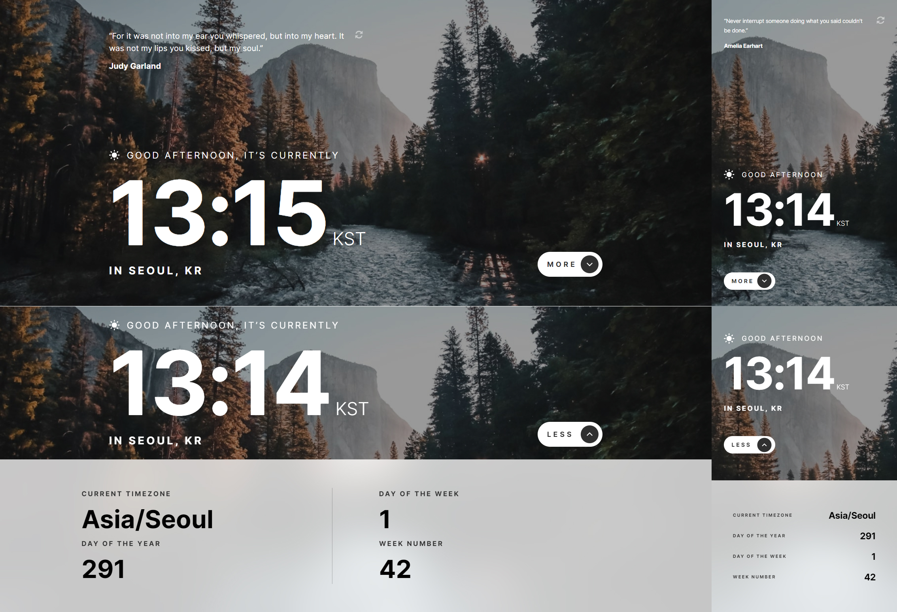

# Frontend Mentor - Clock app solution

This is a solution to the [Clock app challenge on Frontend Mentor](https://www.frontendmentor.io/challenges/clock-app-LMFaxFwrM). Frontend Mentor challenges help you improve your coding skills by building realistic projects.

## Table of contents

- [Overview](#overview)
  - [The challenge](#the-challenge)
  - [Screenshot](#screenshot)
  - [Links](#links)
- [My process](#my-process)
  - [Built with](#built-with)
  - [What I learned](#what-i-learned)
  - [Continued development](#continued-development)
  - [Useful resources](#useful-resources)
- [Author](#author)
- [Acknowledgments](#acknowledgments)

## Overview

### The challenge

Users should be able to:

- View the optimal layout for the site depending on their device's screen size
- See hover states for all interactive elements on the page
- View the current time and location information based on their IP address
- View additional information about the date and time in the expanded state
- Be shown the correct greeting and background image based on the time of day they're visiting the site
- Generate random programming quotes by clicking the refresh icon near the quote
- Change the greeting depending on the time of day. It should say:
  - "Good morning" between 5am and 12pm
  - "Good afternoon" between 12pm and 6pm
  - "Good evening" between 6pm and 5am
- Change the greeting icon and background image depending on the time of day. They should show:
  - The sun icon and the daytime background image between 5am and 6pm
  - The moon icon and the nighttime background image between 6pm and 5am
- Generate a new random programming quote whenever the refresh icon is clicked

### Screenshot

### Links

- Solution URL: [Solution URL here](https://www.frontendmentor.io/solutions/responsive-clock-app-using-react-N1VxBxC_C)

## My process

### Built with

- Semantic HTML5 markup
- CSS custom properties
- Flexbox
- CSS Grid
- Mobile-first workflow
- [React](https://reactjs.org/) - JS library
- [Styled Components](https://styled-components.com/) - For styles

### What I learned

### Continued development

### Useful resources

- [World Time API](http://worldtimeapi.org/) to set the time based on the visitor's IP adress. This API will also be used for additional data, like the day of the year shown in the expanded state.
- [IP Geolocation API](https://geo.ipify.org/) to set the city and country underneath the time
- [Quotes API](https://github.com/lukePeavey/quotable)

## Author

## Acknowledgments
